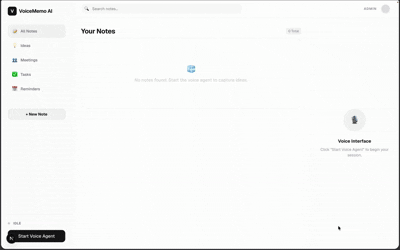
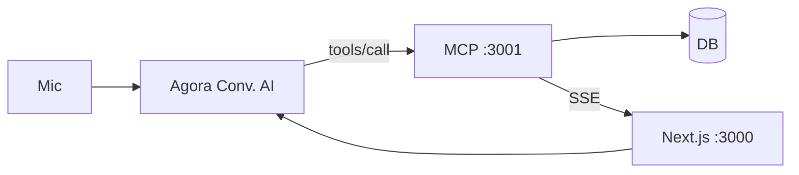

<div align="center">

# VoiceMemo AI

**Speak. It understands. It remembers.**

[](https://github.com/Dukeabaddon/voicememo-ai)
[](LICENSE)
[](https://nextjs.org)
[](https://react.dev)
[](https://www.typescriptlang.org)
[](https://www.agora.io)
[](https://modelcontextprotocol.io)
[](https://pnpm.io)

Voice-first notes: **Agora STT → LLM → MCP tools → SSE → Next.js UI**. Save, edit, delete, and end the call by voice — no typing during a session.



*Demo: join call → save note → edit in-session → end call.*

</div>

---

## Demo flow

| Voice | MCP / UI |
|-------|----------|
| “Save note: call mom at 5 PM” | `save_note` → `note_created` |
| “Change that to 6 PM” | `update_note` (`lastNoteId`) → `note_updated` |
| “Delete that note” | `delete_note` → `note_deleted` |
| “Goodbye” / “End session” | `terminate_session` → UI disconnect |

---

## Stack

| Layer | Tech |
|-------|------|
| UI | Next.js 16 · React 19 · Tailwind 4 · Agora RTC |
| Voice | Agora Conversational AI (Deepgram · OpenAI · MiniMax) |
| Tools | MCP server (HTTP + SSE on `:3001`) |
| Data | Mock JSON (`USE_MOCK_DB=true`) or Couchbase Capella |

---

## Quick start

```bash
git clone https://github.com/Dukeabaddon/voicememo-ai.git
cd voicememo-ai
pnpm install
cp .env.example .env.local   # Agora + OPENAI_API_KEY; USE_MOCK_DB=true
```

**Three terminals**

```bash
pnpm dev          # :3000
pnpm mcp          # :3001
ngrok http 3001   # set MCP_SERVER_URL=https://<host>/mcp in .env.local
```

Open [http://localhost:3000](http://localhost:3000) → **Join Call** → save / edit / goodbye.

Full env list: [`.env.example`](.env.example). Never commit `.env.local`.

---

## Architecture



---

## MCP tools (`AGORA_VOICE_PROFILE=fast`)

| Tool | Use |
|------|-----|
| `save_note` | New note |
| `update_note` | Edit (`query`: `"last"`) |
| `delete_note` | Explicit delete |
| `get_session_context` | Last note in session |
| `terminate_session` | Goodbye / end session |

---

## Agora (minimal)

1. [console.agora.io](https://console.agora.io) — project with **APP ID + Certificate**
2. Enable **Conversational AI** → `AGORA_AGENT_ID` (Pipeline ID)
3. REST API → `AGORA_CUSTOMER_ID` / `AGORA_CUSTOMER_SECRET`
4. `MCP_SERVER_URL` = public HTTPS `/mcp` (ngrok locally)

---

## Scripts

| Command | Role |
|---------|------|
| `pnpm dev` | Next.js |
| `pnpm mcp` | MCP + SSE |
| `pnpm build` | Production build |

---

## Security

Secrets only in `.env.local` (gitignored). Rotate any key that was shared or logged.

---

## Requirements

- Node.js 20+
- [Agora](https://console.agora.io) project with Conversational AI
- `OPENAI_API_KEY` (agent LLM)
- [ngrok](https://ngrok.com) or HTTPS tunnel for local MCP (`MCP_SERVER_URL`)

## License

[MIT](LICENSE) · [Dukeabaddon/voicememo-ai](https://github.com/Dukeabaddon/voicememo-ai)
